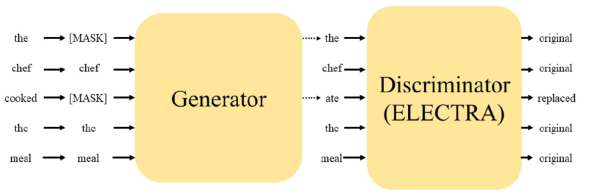

# 🚀 Electra-VNJob-NER

**Electra model for [Named Entity Recognition](https://en.wikipedia.org/wiki/Named-entity_recognition) (NER) with job recruitment information in Vietnam.**  
Welcome to watch ⭐, star ⭐, or fork 🍴.

<div align="center">
    
</div>


---

## 📑 Table of Contents

- [📌 Introduction](#-introduction)
- [📂 VNJob Dataset](#-vnjob-dataset)
  - [📊 Data Formats](#data-formats)
  - [📝 Example Data](#example-data)
- [⚙️ Requirements](#-requirements)
- [📈 Results](#-results)
- [💻 Usage](#-usage)
  - [🔧 Installation](#installation)
  - [📥 Download Dataset](#download-dataset)
  - [📚 Training Electra Model for NER Task](#training-electra-model-for-ner-task)
  - [📊 Evaluate Electra Model](#evaluate-electra-model)
  - [🎛️ Interface Model with Gradio](#interface-model-with-gradio)
- [🤝 Contributing](#-contributing)
- [📜 License](#-license)
- [🔗 References](#-references)

---

## 📌 Introduction

This repository contains an implementation of the **Electra** model for **Named Entity Recognition (NER)**, tailored for processing job recruitment data in Vietnam.

NER plays a crucial role in **automated job-matching systems** by identifying and categorizing entities such as **job titles, skills, locations, and salary ranges** from job postings. This enhances **search relevance** and **recommendation systems** in recruitment platforms.

We chose **Electra**, a transformer-based model, for its efficiency in **pretraining and fine-tuning** tasks. This allows it to capture domain-specific linguistic patterns in Vietnamese job postings, leading to improved **entity recognition performance**.

---

## 📂 VNJob Dataset

### 📊 Data Formats

The VNJob dataset consists of:

- **Training set**: `data/vnjob_train.csv`
- **Validation set**: `data/vnjob_val.csv`

There are **44,273 training samples** and **11,086 validation samples**.  
🚨 **No separate test set is provided.** If needed, you can split the validation set (e.g., 80% for validation, 20% for testing).

The dataset contains **9 types of named entities**:
- 🏷️ **Job title** (`job_title`)
- 🏢 **Job type** (`job_type`)
- 🏆 **Position** (`position`)
- 🌍 **City** (`city`)
- 🎓 **Experience** (`experience`)
- 🛠️ **Skills** (`skills`)
- 📌 **Job fields** (`job_fields`)
- 💰 **Salary** (`salary`)
- ❓ **Other** (`O`)

### 📝 Example Data

| Character | Tag         |
| --------- | ----------- |
| Software  | B-job_title |
| Engineer  | I-job_title |
| at        | O           |
| Hanoi     | B-city      |

---

## ⚙️ Requirements

This project was developed using Python with **PyTorch**.  

📦 Install the dependencies before running the model:

```bash
pip install -r requirements.txt
```

### 📦 Dependencies:
- `torch==2.5.1`
- `numpy==1.26.4`
- `matplotlib==3.7.2`
- `pathlib==1.0.1`
- `transformers==4.47.0`
- `datasets==3.2.0`
- `tqdm==4.66.5`
- `torchmetrics==1.6.0`
- `pandas==2.0.3`

---

## 📈 Results

The model's performance on the VNJob validation set:

| Dataset        | 📊 Accuracy | 🔎 Recall  | 🎯 Precision | 🏆 F1 Score  |
| -------------- | ---------- | ---------- | ---------- | ---------- |
| Training set   | **99.99**  | **99.95**  | **99.94**  | **99.94**  |
| Validation set | **99.51**  | **98.48**  | **97.99**  | **98.24**  |

---

## 💻 Usage

### 🔧 Installation

#### 📥 Clone the Repository
```bash
git clone https://github.com/tinh2044/Electra-VNJob-NER.git
cd Electra-VNJob-NER
```

#### 🛠️ Create Virtual Environment (Recommended)
```bash
conda create --name ElectraNER python=3.9
conda activate ElectraNER
```

#### 📦 Install Dependencies
```bash
pip install -r requirements.txt
```

---

### 📥 Download Dataset

Download the dataset from [Google Drive](https://drive.google.com/drive/folders/1ze6mcyi2UtaXNDfPuPo-EgmPdvsCYGe3?usp=drive_link).  

Ensure the `data/` folder has the following structure:

```
|——data
    |——vnjob_train.csv
    |——vnjob_val.csv
```

---

### 📚 Training Electra Model for NER Task

Run the following command to **train the model**:

```bash
python -m main --task train --epoch 200 --lr 0.001 --batch_size 32 --repo_id tinh2312/Electra-VNJob-NER
```

---

### 📊 Evaluate Electra Model

Run the following command to **evaluate the trained model**:

```bash
python -m main --task eval --batch_size 32 --repo_id tinh2312/Electra-VNJob-NER
```

---

### 🎛️ Interface Model with Gradio

Run the following command to launch the **Gradio demo**:

```bash
python app.py
```
or
```bash
gradio run app.py
```

---

## 🤝 Contributing

🚀 **Contributions are welcome!**  
To contribute:

1. **Fork** this repository.
2. **Create a new branch**:
   ```bash
   git checkout -b feature/your-feature-name
   ```
3. **Make your changes** and commit:
   ```bash
   git commit -m "feat: add new preprocessing step"
   ```
4. **Push to your fork** and submit a **pull request**.

For major changes, please **open an issue** first to discuss your proposal.

---

## 📜 License

This project is licensed under the [MIT License](LICENSE).

---

## 🔗 References

- phongtranWW/crawler [[GitHub]](https://github.com/phongtranWW/crawler)
- Electra: Pre-training text encoders as discriminators rather than generators [[Paper]](https://arxiv.org/abs/2003.10555)
- google-research/electra [[GitHub]](https://github.com/google-research/electra)
- huggingface/electra_model [[GitHub]](https://github.com/huggingface/transformers/blob/main/src/transformers/models/electra/modeling_electra.py)
- chakki-works/seqeval [[GitHub]](https://github.com/chakki-works/seqeval)
